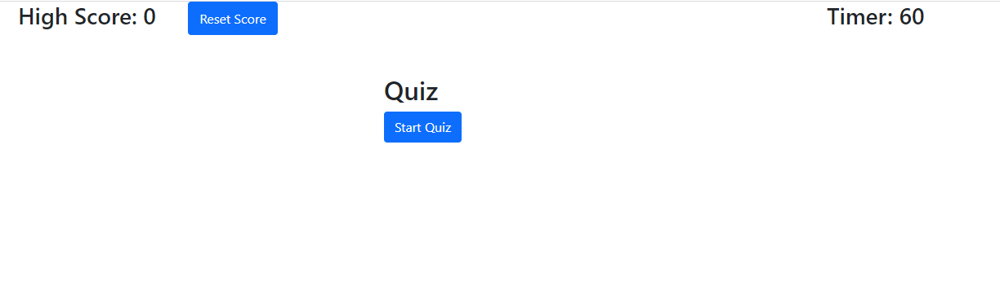
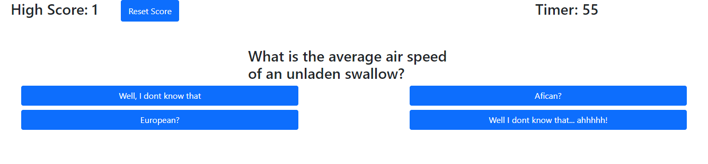

## Description
Click start to take a two question Monty Python (not the language) quiz. The high score is store locally.

## Link
https://derotto54.github.io/homework_04/

## Screenshots

## Notes
Couple bugs and missing features

1. In the function that ends the quiz I need to add a form pop up that allows the user to add their name if they get a high score and store it locally like the score. 

2. I need a proper ending for the quiz when all questions are complete. Right now I rely on the time out. 

3. The quiz generating function needs to be set up where one function takes care of all setting up everything about the ansers. 

